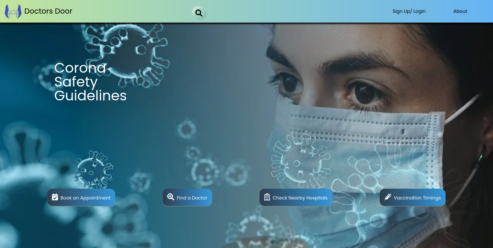
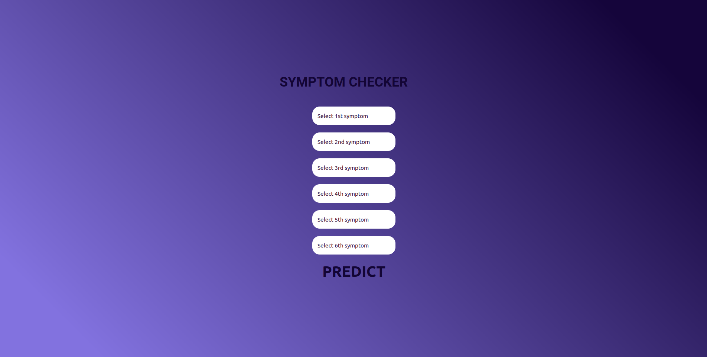
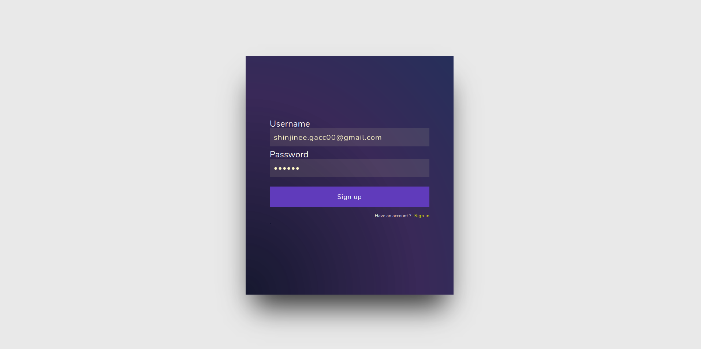

# Doctor’s Door: An instant chatting application for Medical Consultation
## Visit our website - https://doct-door.herokuapp.com/

## Features
- User authentication using Google
- View Doctor details
- Search doctors according to specialization
- Start instant chatting with a doctor assigned by the system - https://github.com/dev-2k/firechat_chat_app
- Symptom Checker - https://github.com/shinjinee/Symptom-Checker

# How to Run:

Run the following commands in terminal from the root directory of the project

`npm install`  
`npm start`

## Languages and Tools  
- React JS
- Firebase: Authentication, Firestore Database, Storage
- HTML
- CSS
- Vanilla JS 

## Sample Output
### Landing Page
  

### Departments
  

### Services
  

### Symptom Checker
  

### Sign in/Sign up
  

### Doctor Search
  

### Chat
  
 
 

 

